# REPSY -- Connecting Doctors and Pharma Sales Reps

## About the app

REPSY is a mobile application designed to change the interactions of doctors and pharma sales representatives. REPSY empowers doctors by making information about pharmaceuticals easily accessible. In addition to providing clinical information about pharmaceuiticals, REPSY allows doctors to take charge of their interactions with sales reps by letting them schedule time to meet--not the other way around.

REPSY was built with React Native and supports IOS and Android.  The app uses a custom-built API of medical conditions and corresponding treatments to help provide information to doctors and connect them to the correct sales representative if needed.  The applications backend is in a separate project and deployed to a Heroku server (https://github.com/GraftonJ/repsy-be)

## Login

The Login screen allows users with an account to login.
 
 
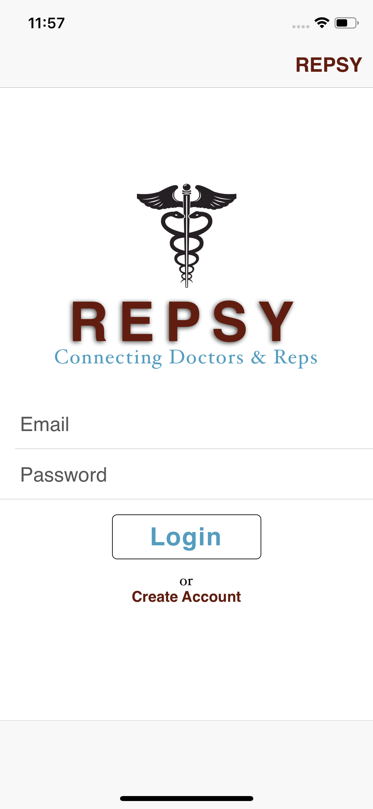

## Create Account

To create an account, the user must choose if they are creating a doctor account or a sales representative account. They are taken to the appropriate form based on their selection
 
 
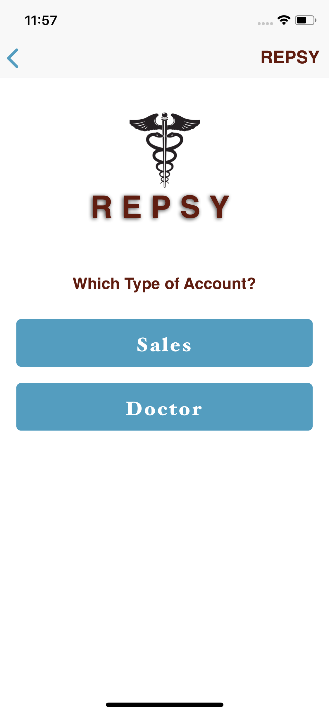

 
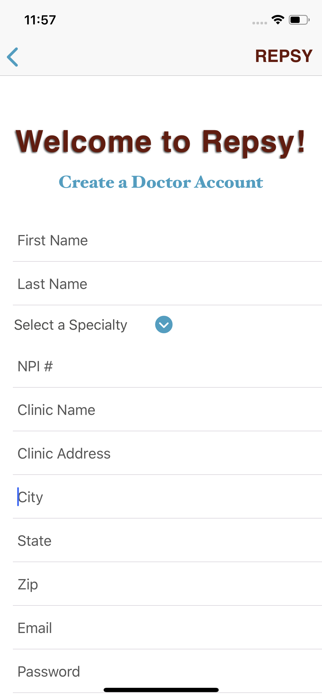

For a doctor account, the user must select a specialty. This will pull the correct information from the API once they login.

 
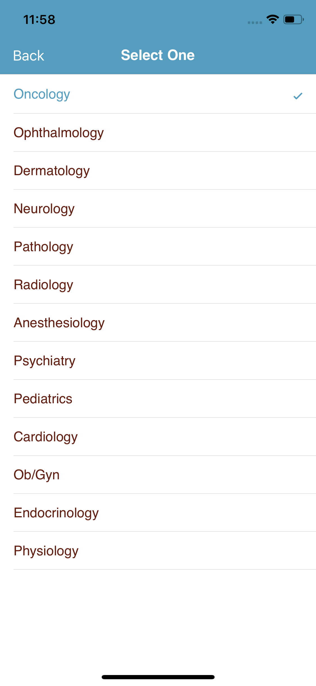

Sales reps create an account by providing personal info and information about their company

 
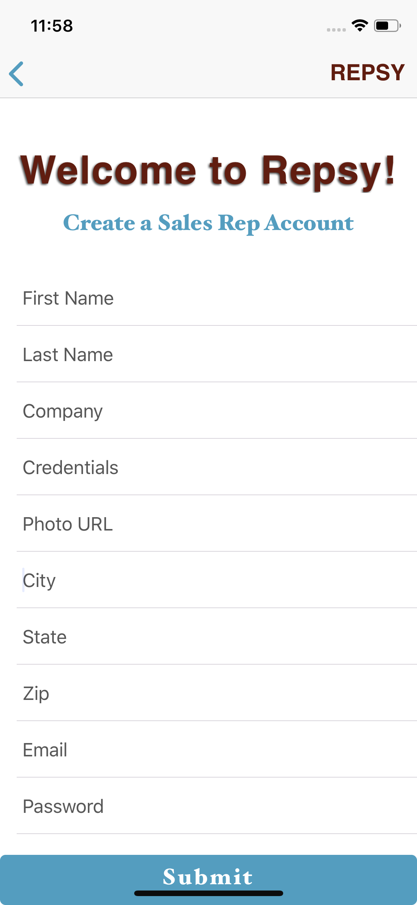

## Homepage

The first time a doctor logs in, the homepage will be empty. The doctor can pin conditions to their homepage by selecting from the list of conditions covered by their specialty (Oncology in this case).

 
 
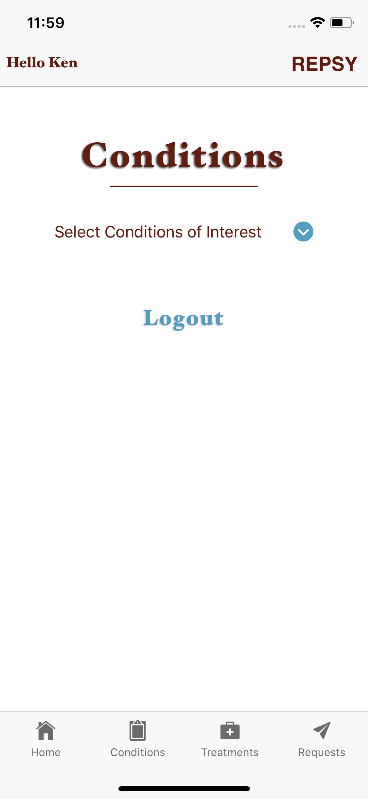

Scrolling list of conditions for the doctor's specialty

 
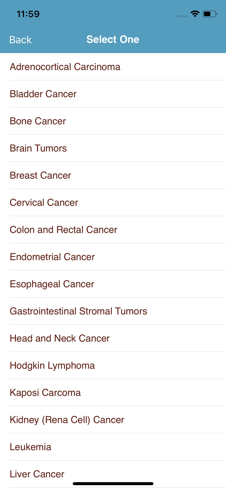

Once a doctor selects a condition from the list, in this case Breast Cancer, it is saved to their homepage until they delete it by clicking the trash icon.

 
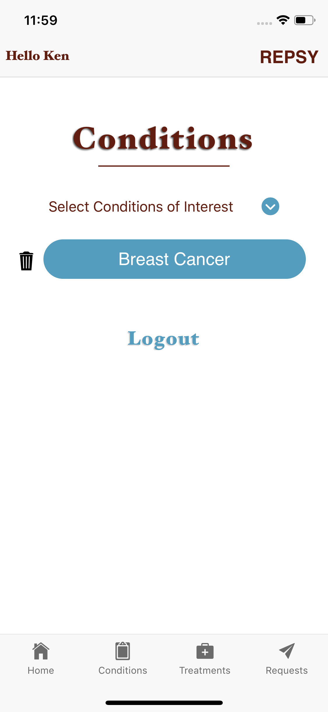

## Conditions & Treatments

A doctor can view information about all conditions their specialty treats by clicking "Conditions" in the footer menu. Clicking any of the conditions from the list brings up a list of pharmaceuticals used to treat that condition.

 
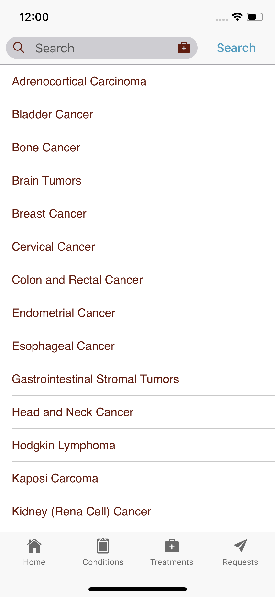

By clicking "Treatments" from the footer menu, a doctor can view a list of pharmaceuticals used to treat any condition covered by his/her specialty. The doctor can filter this list by brand name or generic name.

Generic name list:
 
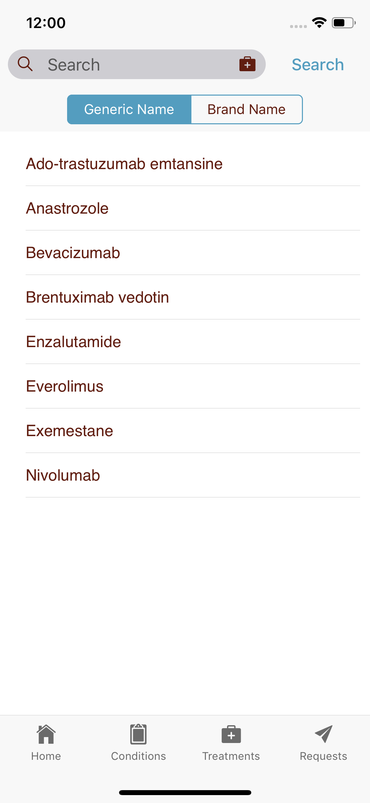

Brand name list:
 
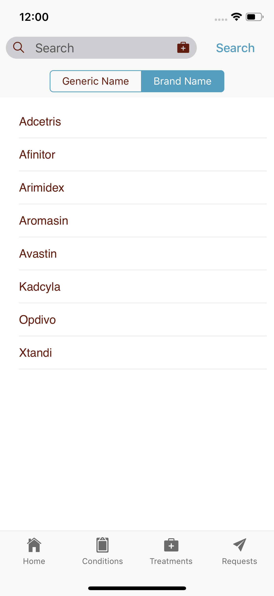

## Treatments for a Particular Conditions

A doctor can click a particular treatment from the homepage or the footer menu list to view treatments for that condition. Clicking a treatment advances to a screen that gives the doctor access to clinical information about that treatment as well as the ability to find a sales representative for more information

List of treatments for Breast Cancer:
 
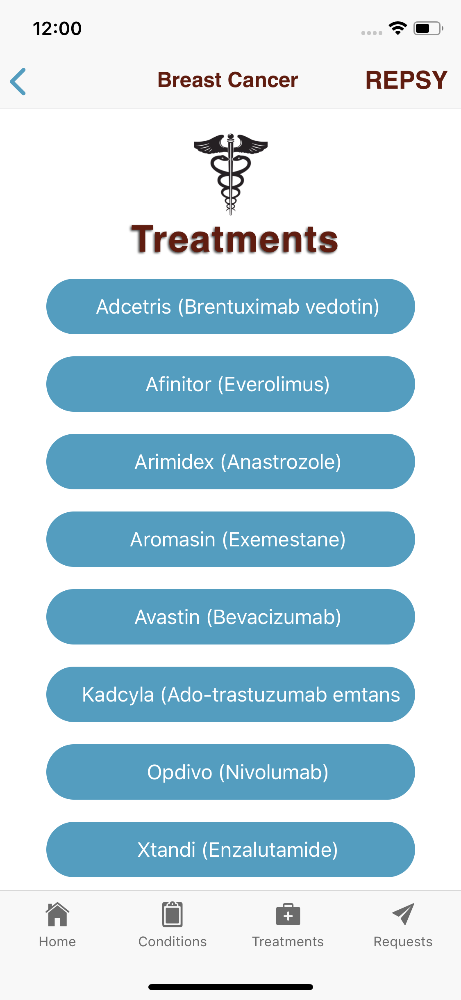

Screen after clicking Kadcyla:
 
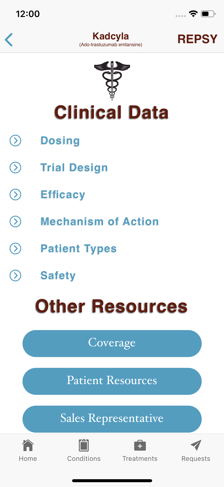

The clincial data at the top pulls information directly from the manufacturer. In this case, clicking "Dosing" opens a screen with the most up to date and accurate dosing information for the treatment.
 
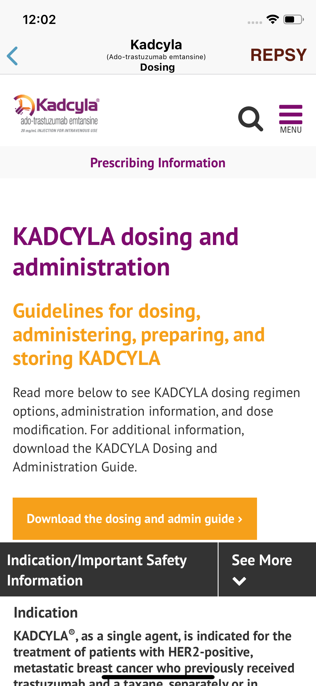

## Sales Representatives

When viewing information about a particular treatment, doctors have the option to click a "Sales Representative" button at the bottom of the screen. When they click this button, they will be taken to a list of potential sales reps in their area. 

"Sales Representative" button on the bottom of the screen
 

Clicking the button takes the doctor to a list of sales reps:
 
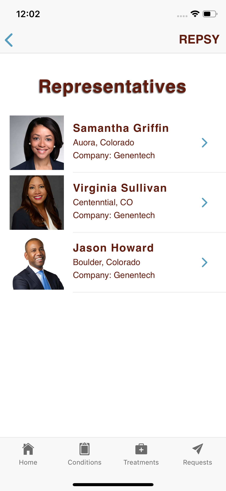

Clicking a sales representative takes the doctor to the reps profile where they can read more about that rep. If they want to speak with the representative, they can schedule a meeting by clicking "Schedule Appointment":
 
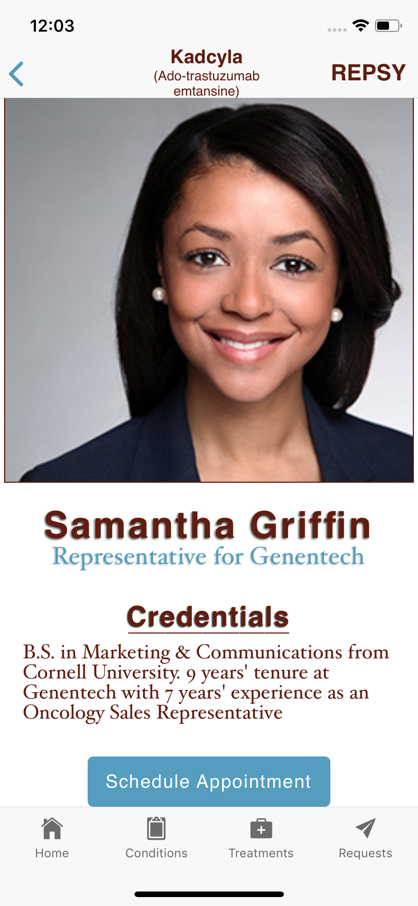

To schedule an appointment, the doctor enters their information, what they want to speak about, and selects a time:
 
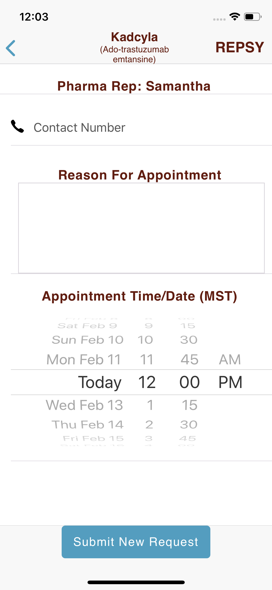

When the doctor submits the request, an email is sent to the doctor and the sales representative who has the option to accept or decline. The appointment gets placed on both parties calendars:
 
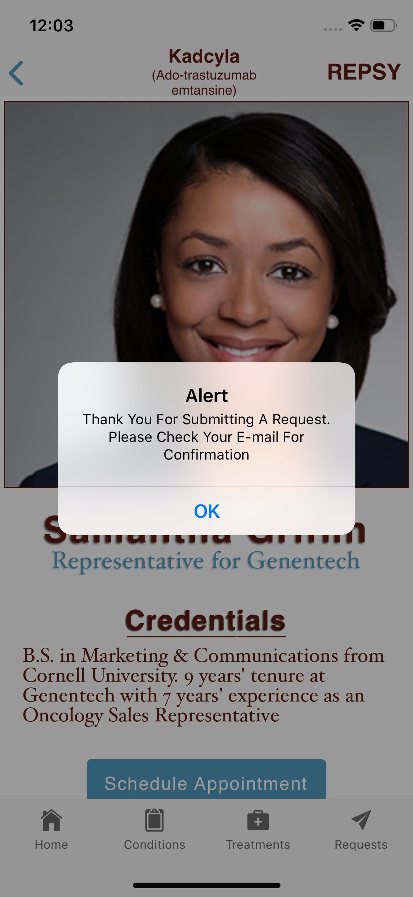
